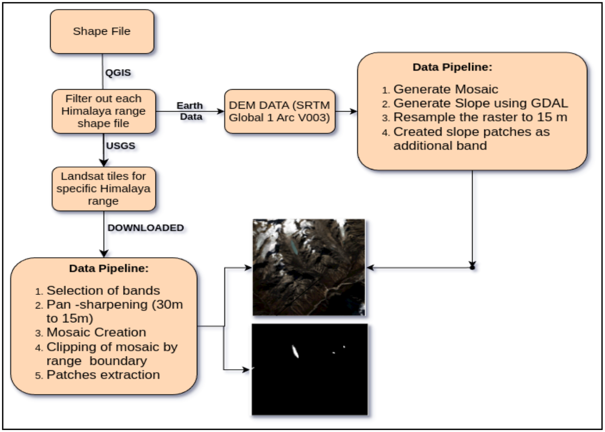

# 🧊 Glacial Lake Segmentation Dataset

This dataset supports the task of glacial lake segmentation across six Himalayan sub-regions using satellite imagery and digital elevation data. It includes patches of Landsat imagery, spectral indices, and slope maps derived from DEM data.

---

## 📍 Regions Covered

- Eastern Himalaya
- Central Himalaya
- Western Himalaya
- Nyainqentanglha
- Gangdise Mountains
- Hindu Kush

---

## 🗂 Dataset Composition

Each sample is a 128×128 patch composed of the following **9 channels**:

- RGB
- NIR
- SWIR1, SWIR2
- NDWI (Normalized Difference Water Index)
- NDSI (Normalized Difference Snow Index)
- Slope (from DEM)

---

## 🛠 Preprocessing Pipeline

The dataset was prepared using the following steps:

### 1. **Landsat Tile Selection**
- **Cloud cover < 10%**, **post-monsoon months (July–December)**.
- Tiles chosen via [USGS Earth Explorer](https://earthexplorer.usgs.gov/).

### 2. **Pan-Sharpening**
- Fused the 15m panchromatic band with 30m multispectral bands to improve spatial resolution.

### 3. **Mosaic Creation**
- Tiles for each region were mosaicked using:
  - RGB, NIR, SWIR1, SWIR2
  - NDWI = (Green - NIR) / (Green + NIR)
  - NDSI = (Green - SWIR1) / (Green + SWIR1)

### 4. **Patch Extraction**
- Extracted **128×128** patches with:
  - Full valid data
  - At least one glacial lake present

### 5. **DEM & Slope Integration**
- DEM data from NASA's 1-arc-second SRTM used to compute slope
- Reprojected to UTM zone EPSG:32645 to align with Landsat

### 6. **Pipeline Automation**
- Fully automated using Python and GDAL tools:
  
### 7. **Dataset Splitting**
- Training: 70%
- Validation: 10%
- Testing: 20%  
(Ensured spatial disjointness)

---

## 📊 Dataset Pipeline Diagram

---

## 📚 Citation

If you use this dataset, please cite:

> Chen, F. et al., *Annual 30 m dataset for glacial lakes in high mountain Asia from 2008 to 2017*, Earth System Science Data, 2021.

---

## 📄 License

This dataset is distributed under the [MIT License](../LICENSE).

